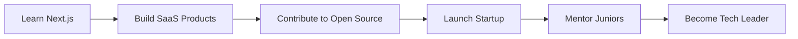

<div align="center">

# 👋 Hi, I'm Chandan Kumar


[](https://chandankumar.dev)
[](https://linkedin.com/in/chandankumar)
[](https://twitter.com/chandankumar)
[](mailto:chandan@example.com)


</div>

---

## 🚀 About Me


```javascript
const chandan = {
    location: "Delhi, India 🇮🇳",
    education: "Computer Science Graduate 🎓",
    currentFocus: "Full Stack Development 💻",
    passion: "Restaurant Tech & Hospitality 🍽️",
    
    dailyRoutine: {
        morning: "☕ Coffee + Code",
        afternoon: "🍱 Build Features",
        evening: "🌙 Learn New Tech",
        night: "🚀 Deploy Projects"
    },
    
    currentProjects: [
        "Chandan Ka Dhaba - Restaurant Website 🏪",
        "E-commerce Platform 🛒",
        "Portfolio Website 🎨"
    ],
    
    lifeGoal: "Build products that make a difference! ✨"
};
```

### 🎯 Quick Facts

- 🔭 I'm currently working on **Restaurant Management System**
- 🌱 I'm currently learning **React.js, Node.js, MongoDB**
- 👯 I'm looking to collaborate on **Open Source Projects**
- 💬 Ask me about **Web Development, UI/UX, Restaurant Tech**
- ⚡ Fun fact: **I can debug code faster than I can cook! 😄**
- 🎮 Hobbies: **Gaming, Photography, Food Blogging**

---

## 💻 Tech Stack

<div align="center">

### 🎨 Frontend Development

<p>


</p>

### ⚙️ Backend Development

<p>


</p>

### 🗄️ Databases

<p>


</p>

### 🛠️ Tools & Technologies

<p>


</p>

### 🎯 Currently Learning

<p>


</p>

</div>

---

## 📊 GitHub Statistics

<div align="center">


### 🏆 GitHub Trophies


### 📈 Contribution Graph


</div>

---

## 🎨 Featured Projects

<div align="center">

<table>
<tr>
<td width="50%">

<h3 align="center">🍽️ Chandan Ka Dhaba</h3>

<div align="center">
<a href="https://github.com/Chandankumar775/web-dev-project-" target="_blank">

</a>

**Tech Stack:** HTML • CSS • JavaScript • Bootstrap

Full-featured restaurant website with cart, search, dark mode & more!

[🔗 Live Demo](https://web-dev-project-chandankumar775.vercel.app) • [📂 Repository](https://github.com/Chandankumar775/web-dev-project-)

</div>

</td>
<td width="50%">

<h3 align="center">🚀 Portfolio Website</h3>

<div align="center">


**Tech Stack:** React • Tailwind • Framer Motion

Modern portfolio showcasing my work and skills

[🔗 Live Demo](#) • [📂 Repository](#)

</div>

</td>
</tr>

<tr>
<td width="50%">

<h3 align="center">🛒 E-Commerce Platform</h3>

<div align="center">


**Tech Stack:** MERN Stack • Redux • Stripe

Full-stack e-commerce with payment integration

[🔗 Live Demo](#) • [📂 Repository](#)

</div>

</td>
<td width="50%">

<h3 align="center">📱 Social Media App</h3>

<div align="center">


**Tech Stack:** React Native • Firebase • Socket.io

Real-time chat and social networking app

[🔗 Live Demo](#) • [📂 Repository](#)

</div>

</td>
</tr>
</table>

</div>

---

## 🎯 Coding Activity

<div align="center">

<!--START_SECTION:waka-->
```text
JavaScript   12 hrs 30 mins  ████████████░░░░░░░░░  52.3%
HTML/CSS     5 hrs 20 mins   ██████░░░░░░░░░░░░░░░  22.4%
React        3 hrs 45 mins   ████░░░░░░░░░░░░░░░░░  15.7%
Node.js      1 hr 30 mins    ██░░░░░░░░░░░░░░░░░░░   6.3%
Other        50 mins         █░░░░░░░░░░░░░░░░░░░░   3.3%
```
<!--END_SECTION:waka-->

### 💼 This Week I Spent My Time On:


</div>

---

## 🎨 Skills Visualization

<div align="center">

<table>
<tr>
<td valign="top" width="33%">

### 🎯 Frontend
- HTML5, CSS3, JavaScript
- React.js, Bootstrap, Tailwind
- Responsive Design
- UI/UX Principles
- Animation Libraries
- PWA Development

</td>
<td valign="top" width="33%">

### ⚡ Backend
- Node.js, Express.js
- RESTful APIs
- Authentication (JWT)
- Database Design
- Server Deployment
- API Documentation

</td>
<td valign="top" width="33%">

### 🛠️ DevOps
- Git & GitHub
- CI/CD Pipelines
- Docker Basics
- Cloud Deployment
- Performance Optimization
- Testing & Debugging

</td>
</tr>
</table>


</div>

---

## 🏆 Achievements & Certifications

<div align="center">

<table>
<tr>
<td align="center" width="25%">

### 🎓
**CS Graduate**
<br>
Bachelor's Degree

</td>
<td align="center" width="25%">

### 🥇
**Top Contributor**
<br>
Open Source 2024

</td>
<td align="center" width="25%">

### 💻
**Full Stack Dev**
<br>
Certified Developer

</td>
<td align="center" width="25%">

### 🌟
**Problem Solver**
<br>
500+ Solved

</td>
</tr>
</table>

</div>

---

## 📝 Latest Blog Posts

<div align="center">

<!-- BLOG-POST-LIST:START -->
- 🍽️ [Building a Restaurant Website with Pure JavaScript](https://blog.example.com)
- 🎨 [Modern UI/UX Trends in 2025](https://blog.example.com)
- 🚀 [Optimizing Web Performance - A Complete Guide](https://blog.example.com)
- 💡 [From Idea to Deployment - My Journey](https://blog.example.com)
<!-- BLOG-POST-LIST:END -->

[➡️ More blog posts...](https://blog.example.com)

</div>

---

## 🎯 Goals for 2025

<div align="center">



**Progress Tracker:**


</div>

---

## 🎮 When I'm Not Coding

<div align="center">

<table>
<tr>
<td align="center" width="25%">

<br><strong>Gaming 🎮</strong>
<br><sub>FPS & Strategy</sub>
</td>
<td align="center" width="25%">

<br><strong>Photography 📷</strong>
<br><sub>Street & Food</sub>
</td>
<td align="center" width="25%">

<br><strong>Food Vlogging 🍔</strong>
<br><sub>Restaurant Reviews</sub>
</td>
<td align="center" width="25%">

<br><strong>Traveling ✈️</strong>
<br><sub>Exploring Places</sub>
</td>
</tr>
</table>

</div>

---

## 🤝 Let's Connect & Collaborate

<div align="center">


### 💬 Get In Touch

<p>
<a href="https://github.com/Chandankumar775">

</a>
<a href="https://linkedin.com/in/chandankumar">

</a>
<a href="https://twitter.com/chandankumar">

</a>
<a href="https://instagram.com/chandankumar">

</a>
<a href="mailto:chandan@example.com">

</a>
<a href="https://wa.me/919876543210">

</a>
</p>

### 📫 How to reach me:

```javascript
const contactMe = {
    email: "chandan@example.com",
    linkedin: "linkedin.com/in/chandankumar",
    twitter: "@chandankumar",
    website: "chandankumar.dev",
    location: "Delhi, India"
};

// Feel free to reach out for:
// ✅ Collaborations
// ✅ Freelance Projects
// ✅ Tech Discussions
// ✅ Mentorship
// ✅ Just to say Hi! 👋
```

</div>

---

## 💰 Support My Work

<div align="center">

<p>If you like my work and want to support me, consider:</p>

<a href="https://www.buymeacoffee.com/chandankumar">

</a>
<a href="https://ko-fi.com/chandankumar">

</a>
<a href="https://www.patreon.com/chandankumar">

</a>

**⭐ Star my repositories if you find them useful!**

</div>

---

## 📈 Profile Summary

<div align="center">


### 🐍 Contribution Snake


</div>

---

## 🎵 Now Playing on Spotify

<div align="center">

[](https://open.spotify.com/user/chandankumar)

</div>

---

## 💡 Random Dev Quote

<div align="center">


</div>

---

## 😄 Random Dev Joke

<div align="center">


</div>

---

<div align="center">


### ⚡ "Code is poetry, and I'm a poet!" ⚡


**Made with ❤️ and lots of ☕**


</div>
