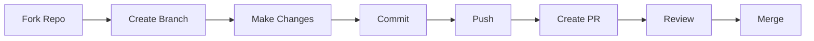

<div align="center">

# 🍽️ Chandan Ka Dhaba


[](https://web-dev-project-chandankumar775.vercel.app)
[](https://github.com/Chandankumar775)
[](https://github.com/Chandankumar775/web-dev-project-/stargazers)
[](https://github.com/Chandankumar775/web-dev-project-/network)


### 🎯 A Revolutionary Restaurant & Hotel Website Experience

*Combining traditional dhaba warmth with cutting-edge web technology*

[🌐 Live Demo](https://web-dev-project-chandankumar775.vercel.app) • [📖 Documentation](./DEPLOYMENT.md) • [🐛 Report Bug](https://github.com/Chandankumar775/web-dev-project-/issues) • [✨ Request Feature](https://github.com/Chandankumar775/web-dev-project-/issues)

---

### 💎 Tech Stack

<p align="center">
  
  
  
  
  
</p>

<p align="center">
  
  
  
  
</p>


</div>

<br>

## 🎯 Features That Make Us Unique

<div align="center">

<table>
<tr>
<td width="33%" align="center">

### 🛒 Smart Cart System


**Add to Cart** • **LocalStorage** • **WhatsApp Checkout**

Real-time cart with persistent data across sessions

</td>
<td width="33%" align="center">

### 🎤 Voice Search


**Web Speech API** • **Real-time Results** • **Smart Filtering**

Search dishes using your voice!

</td>
<td width="33%" align="center">

### 🌓 Dark Mode


**Toggle Switch** • **Persistent** • **Eye-friendly**

Seamless dark/light theme switching

</td>
</tr>

<tr>
<td width="33%" align="center">

### ❤️ Favorites System


**Wishlist** • **LocalStorage** • **Quick Access**

Save your favorite dishes for later

</td>
<td width="33%" align="center">

### 🎞️ Hero Slideshow


**Auto-rotate** • **Manual Control** • **Smooth Transitions**

Beautiful image carousel on homepage

</td>
<td width="33%" align="center">

### 📊 Compare Dishes


**Side-by-side** • **Up to 3 Items** • **Detailed View**

Compare prices, ratings, and ingredients

</td>
</tr>

<tr>
<td width="33%" align="center">

### 🗺️ Nearby Places


**Tourist Spots** • **Hospitals** • **Shopping** • **Transport**

Explore what's around our dhaba

</td>
<td width="33%" align="center">

### 📱 QR Code Menu


**Generate** • **Download** • **Share**

Contactless menu access via QR

</td>
<td width="33%" align="center">

### 🏨 Room Booking


**3 Room Types** • **Real-time** • **WhatsApp**

Book your stay instantly

</td>
</tr>
</table>


</div>

## 🎨 Visual Experience

<div align="center">

### 🖼️ Screenshots Carousel

<table>
<tr>
<td width="50%">

#### 🏠 Homepage with Hero Slideshow


</td>
<td width="50%">

#### 🍽️ Interactive Menu & Cart


</td>
</tr>

<tr>
<td width="50%">

#### 🌓 Dark Mode Design


</td>
<td width="50%">

#### 🗺️ Nearby Places Feature


</td>
</tr>

<tr>
<td width="50%">

#### 🖼️ Gallery with Filters


</td>
<td width="50%">

#### 👥 Team Profiles


</td>
</tr>
</table>


</div>

## 🛠️ Technology Arsenal

<div align="center">

<table>
<tr>
<td align="center" width="20%">

<br><strong>HTML5</strong>
<br><sub>Semantic Structure</sub>
</td>
<td align="center" width="20%">

<br><strong>CSS3</strong>
<br><sub>Modern Styling</sub>
</td>
<td align="center" width="20%">

<br><strong>JavaScript</strong>
<br><sub>ES6+ Features</sub>
</td>
<td align="center" width="20%">

<br><strong>Bootstrap 5</strong>
<br><sub>Responsive Grid</sub>
</td>
<td align="center" width="20%">

<br><strong>Lottie</strong>
<br><sub>Animations</sub>
</td>
</tr>
</table>

### 🎯 Core Technologies

```yaml
Frontend:
  Structure: HTML5 (Semantic, SEO-friendly)
  Styling: CSS3 (Variables, Grid, Flexbox, Animations)
  Logic: Vanilla JavaScript (ES6+, Async/Await, LocalStorage)
  Framework: Bootstrap 5.3.0 (Grid System, Components)

Libraries:
  Icons: Font Awesome 6.4.0
  Fonts: Google Fonts (Playfair Display, Poppins)
  Animations: AOS (Animate on Scroll)
  Gallery: GLightbox (Lightbox Viewer)
  QR Code: QRCode.js 1.0.0
  Lottie: Lottie Player (Web Component)

APIs:
  Speech: Web Speech API (Voice Search)
  Storage: LocalStorage API (Cart, Favorites, Preferences)
  Maps: Google Maps Directions API

Deployment:
  Platform: Vercel (Serverless, Auto-deploy, HTTPS)
  CI/CD: GitHub Actions (Auto-deployment workflow)
  Version Control: Git & GitHub
```


</div>

## 📂 Project Architecture

<div align="center">

```
🌳 web-dev-project-/
│
├── 📄 HTML Pages (7 files)
│   ├── 🏠 index.html           → Homepage with hero slideshow
│   ├── 👥 about.html           → Team & story with real photos
│   ├── 🍽️ menu.html            → Interactive menu with cart
│   ├── 🖼️ gallery.html         → Photo gallery with filters
│   ├── 🏨 rooms.html           → Room booking system
│   ├── 📞 contact.html         → Contact form & map
│   └── 🧪 test-lottie.html     → Animation testing
│
├── 🎨 CSS (1 file, 2800+ lines)
│   └── css/
│       └── style.css           → All styling (responsive, dark mode)
│
├── ⚡ JavaScript (6 files, 2500+ lines)
│   └── js/
│       ├── main.js             → Core functionality (400+ lines)
│       ├── advanced-features.js → Cart, search, favorites (700+ lines)
│       ├── menu-filter.js      → Menu filtering logic
│       ├── gallery.js          → Gallery functionality
│       ├── booking.js          → Room booking logic
│       └── contact.js          → Form validation
│
├── 🖼️ Images (3 files)
│   └── images/
│       ├── chandan.jpg         → Owner photo
│       ├── krish.jpg           → Co-owner photo
│       └── yashoda.jpg         → Manager photo
│
├── 🎬 Lottie Animations (4 files)
│   ├── Restaurant 3D.json
│   ├── Eating Fast food.json
│   ├── Delivery guy out for delivery.json
│   └── Scan Menu.json
│
├── ⚙️ Configuration
│   ├── vercel.json            → Vercel deployment config
│   ├── .gitignore             → Git ignore rules
│   └── .github/               → GitHub templates & workflows
│       ├── workflows/
│       │   └── deploy.yml     → Auto-deployment workflow
│       ├── ISSUE_TEMPLATE/
│       │   ├── bug_report.md
│       │   └── feature_request.md
│       └── pull_request_template.md
│
└── 📚 Documentation
    ├── README.md              → This file (you are here!)
    ├── LICENSE                → MIT License
    ├── CONTRIBUTING.md        → Contribution guidelines
    ├── DEPLOYMENT.md          → Deployment guide
    ├── DEPLOYMENT-READINESS-REPORT.md
    └── PRE-DEPLOYMENT-CHECK.md
```

### 📊 Project Statistics

<table align="center">
<tr>
<td align="center">

<br><strong>Total Files</strong>
</td>
<td align="center">

<br><strong>Code Lines</strong>
</td>
<td align="center">

<br><strong>Features</strong>
</td>
<td align="center">

<br><strong>Team Size</strong>
</td>
</tr>
</table>


</div>

## 🎨 Design System

<div align="center">

### Color Palette

<table>
<tr>
<td align="center" width="25%">

<br><strong>Primary</strong>
<br><code>#6F4E37</code>
<br>☕ Coffee Brown
</td>
<td align="center" width="25%">

<br><strong>Secondary</strong>
<br><code>#D4A656</code>
<br>✨ Gold
</td>
<td align="center" width="25%">

<br><strong>Dark</strong>
<br><code>#1A1A1A</code>
<br>🌑 Rich Black
</td>
<td align="center" width="25%">

<br><strong>Light</strong>
<br><code>#FFF7E6</code>
<br>☁️ Cream
</td>
</tr>
</table>

### Typography

```yaml
Headings: 'Playfair Display', serif
  - Elegant, classic restaurant feel
  - Weights: 400, 700

Body Text: 'Poppins', sans-serif
  - Modern, highly readable
  - Weights: 300, 400, 500, 600, 700
```

### Spacing & Layout

```css
Container Max Width: 1200px
Grid System: Bootstrap 5 (12 columns)
Breakpoints:
  - Mobile: 320px - 767px
  - Tablet: 768px - 991px
  - Desktop: 992px+
Border Radius: 8px - 15px
Box Shadow: 0 5px 20px rgba(0,0,0,0.1)
Transitions: 0.3s ease
```


</div>

## 📱 Page Breakdown

<div align="center">

<table>
<tr>
<td width="33%" align="center">

### 🏠 Homepage
**index.html**

🎬 Hero Slideshow (4 images)  
✨ Features Showcase  
🎯 Chef's Special Daily  
💎 Explore Offers Section  
📍 Nearby Places (18+ locations)  
💬 Testimonials Carousel  
📞 Contact Ways

<sub>🔥 Most Interactive Page</sub>

</td>
<td width="33%" align="center">

### 👥 About Us
**about.html**

📖 Our Story  
👨‍🍳 Team Profiles (Real Photos)  
💪 Core Values  
🏆 Why Choose Us  
🎨 Beautiful Visuals  
🌟 Company Mission

<sub>🎯 Know The Team</sub>

</td>
<td width="33%" align="center">

### 🍽️ Menu
**menu.html**

🔍 Smart Search  
🎤 Voice Search  
🗂️ 6 Categories  
🛒 Shopping Cart  
❤️ Favorites  
📊 Compare Dishes  
📱 QR Code Menu

<sub>🛒 E-Commerce Ready</sub>

</td>
</tr>

<tr>
<td width="33%" align="center">

### 🖼️ Gallery
**gallery.html**

📸 4 Categories  
🔍 Lightbox Viewer  
🎯 Filter System  
🖱️ Hover Effects  
📱 Responsive Grid  
✨ Smooth Animations

<sub>🎨 18+ Images</sub>

</td>
<td width="33%" align="center">

### 🏨 Rooms
**rooms.html**

🛏️ 3 Room Types  
💰 Pricing Details  
✅ Amenities List  
📅 Booking Modal  
📱 WhatsApp Booking  
🌟 Room Features

<sub>🏨 Hotel System</sub>

</td>
<td width="33%" align="center">

### 📞 Contact
**contact.html**

📝 Contact Form  
🗺️ Location Map  
❓ FAQ Section  
📞 Multiple Contacts  
✉️ Email Integration  
⏰ Working Hours

<sub>📧 Get In Touch</sub>

</td>
</tr>
</table>


</div>

## 🚀 Quick Start Guide

<div align="center">

### 🏃‍♂️ Get Started in 3 Steps

<table>
<tr>
<td align="center" width="33%">

#### 1️⃣ Clone Repository

```bash
git clone https://github.com/Chandankumar775/web-dev-project-.git
```


</td>
<td align="center" width="33%">

#### 2️⃣ Open Project

```bash
cd web-dev-project-
```

Open `index.html` in browser


</td>
<td align="center" width="33%">

#### 3️⃣ You're Done!

No npm install needed!
Pure static website


</td>
</tr>
</table>

---

### 🌐 Deploy to Production

<table>
<tr>
<td width="50%" align="center">

### 🔷 Deploy to Vercel (Recommended)

[](https://vercel.com/new/clone?repository-url=https://github.com/Chandankumar775/web-dev-project-)

**OR via CLI:**

```bash
npm install -g vercel
vercel login
vercel --prod
```

**⚡ Live in 30 seconds!**

</td>
<td width="50%" align="center">

### 🟢 Deploy to Netlify

[](https://app.netlify.com/start/deploy?repository=https://github.com/Chandankumar775/web-dev-project-)

**OR drag & drop:**

1. Go to [netlify.com](https://netlify.com)
2. Drag project folder
3. Done!

**🚀 Instant deployment!**

</td>
</tr>
</table>

### 📡 Local Server Options

```bash
# Option 1: Python
python -m http.server 8000

# Option 2: Node.js
npx http-server -p 8000

# Option 3: PHP
php -S localhost:8000

# Option 4: VS Code Live Server Extension
Right-click index.html → "Open with Live Server"
```


</div>

## 📝 Customization Guide

### Update WhatsApp Number

Replace `919876543210` with your actual WhatsApp number in:
- All HTML files (navbar button)
- `js/booking.js`
- `js/contact.js`

### Update Restaurant Info

Edit the following in HTML files:
- Address
- Phone numbers
- Email addresses
- Opening hours
- Social media links

### Add Your Lottie Animation

1. Place your Lottie JSON file in the root directory
2. Update the path in `js/main.js`:
```javascript
fetch('../your-lottie-file.json')
```

### Update Images

Replace Unsplash image URLs with your actual images:
- Use your restaurant photos
- Use your room photos
- Use your food photos

### Customize Colors

Edit CSS variables in `css/style.css`:
```css
:root {
    --primary-color: #YourColor;
    --secondary-color: #YourColor;
}
```

## 🌐 Browser Support

- Chrome (latest)
- Firefox (latest)
- Safari (latest)
- Edge (latest)
- Mobile browsers

## 👥 Meet The Dream Team

<div align="center">

<table>
<tr>
<td align="center" width="33%">


### 👨‍💼 Chandan Kumar

**Owner & Founder**

[](https://github.com/Chandankumar775)
[](https://linkedin.com)

*Visionary leader with passion for hospitality*

</td>
<td align="center" width="33%">


### 👨‍💻 Krish Garg

**Co-Owner & Tech Lead**

[](https://github.com)
[](https://linkedin.com)

*Tech enthusiast driving innovation*

</td>
<td align="center" width="33%">


### 👩‍💼 Yashoda Thapa

**Manager & Operations Head**

[](https://github.com)
[](https://linkedin.com)

*Ensuring smooth operations daily*

</td>
</tr>
</table>

### 🤝 Collaboration Stats


</div>

## 🤝 Contributing

<div align="center">

We love contributions! Whether it's bug fixes, feature additions, or documentation improvements.

### 🌟 Ways to Contribute

<table>
<tr>
<td align="center" width="25%">

#### 🐛 Report Bugs

[Create Issue](https://github.com/Chandankumar775/web-dev-project-/issues)

Found a bug? Let us know!

</td>
<td align="center" width="25%">

#### 💡 Suggest Features

[Request Feature](https://github.com/Chandankumar775/web-dev-project-/issues)

Have an idea? Share it!

</td>
<td align="center" width="25%">

#### 🔀 Submit PR

[Pull Request](https://github.com/Chandankumar775/web-dev-project-/pulls)

Code ready? Send it!

</td>
<td align="center" width="25%">

#### ⭐ Star Repo

[Star Now](https://github.com/Chandankumar775/web-dev-project-)

Love it? Star it!

</td>
</tr>
</table>

### 📝 Contribution Process



Read our [Contributing Guidelines](CONTRIBUTING.md) for detailed instructions.


</div>

## 📄 License

<div align="center">

[](LICENSE)

This project is licensed under the **MIT License** - see the [LICENSE](LICENSE) file for details.

**Free to use, modify, and distribute!** 🎉

</div>

## 📞 Contact & Support

<div align="center">

### 💬 Get In Touch

<table>
<tr>
<td align="center" width="33%">

#### 📧 Email Us

**info@chandankadhaba.com**

For business inquiries

</td>
<td align="center" width="33%">

#### 📱 Call Us

**+91 98765 43210**

Available 24/7

</td>
<td align="center" width="33%">

#### 💬 WhatsApp

**[Chat Now](https://wa.me/919876543210)**

Quick responses

</td>
</tr>
</table>

### 🔗 Follow Us

[](https://github.com/Chandankumar775/web-dev-project-)
[](https://facebook.com)
[](https://instagram.com)
[](https://twitter.com)
[](https://youtube.com)

</div>

## 🙏 Acknowledgments

<div align="center">

Special thanks to these amazing resources:

| Resource | Purpose |
|----------|---------|
| 🎨 [Unsplash](https://unsplash.com) | Beautiful stock images |
| 🖼️ [Lottie Files](https://lottiefiles.com) | Amazing animations |
| 🎯 [Font Awesome](https://fontawesome.com) | Icon library |
| 📐 [Bootstrap](https://getbootstrap.com) | Responsive framework |
| 🚀 [Vercel](https://vercel.com) | Hosting platform |
| 💚 [GitHub](https://github.com) | Version control |

</div>

## 📊 Project Stats

<div align="center">


</div>

---

<div align="center">


### Made with ❤️ and ☕ by Team Chandan Ka Dhaba

**⭐ Don't forget to star this repo if you found it helpful! ⭐**


[⬆ Back to Top](#-chandan-ka-dhaba)

</div>
